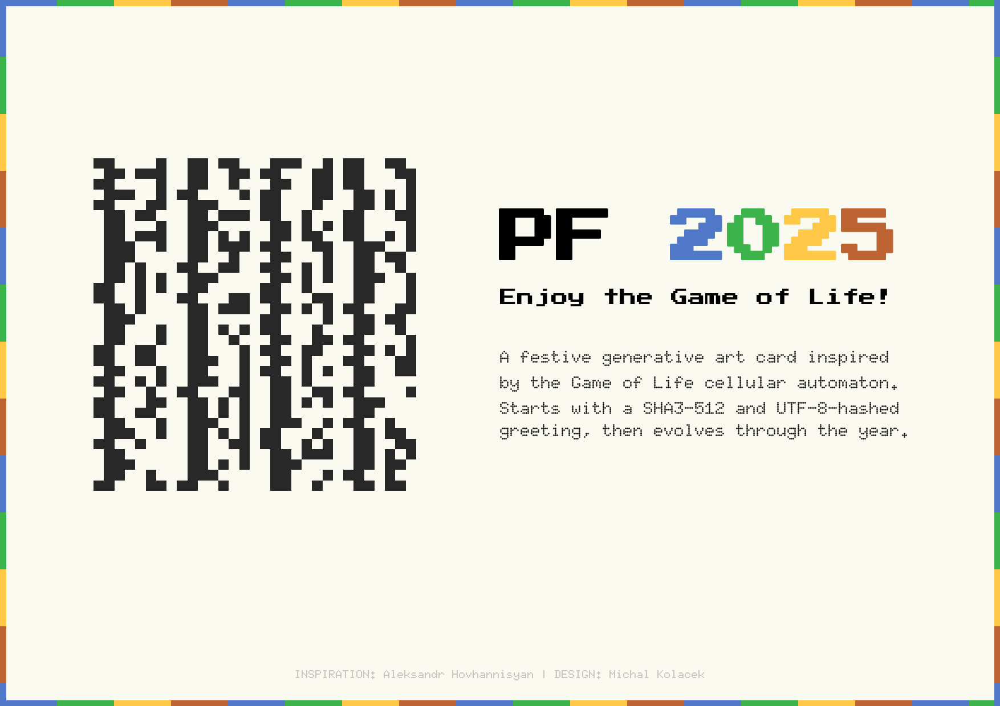

# hashart-life

Inspired by [Aleksandr](https://www.aleksandrhovhannisyan.com/blog/144-shades-of-gray/)
and [Jordan](https://hash.jordanscales.com/), I created my own generative hashart --
a PF 2025 card with a [SHA3-512](https://en.wikipedia.org/wiki/SHA-3)
and [UTF-8](https://en.wikipedia.org/wiki/UTF-8)-hashed greeting on a 32x32 grid,
which then evolves throughout the year as a
[Game of Life cellular automaton](https://en.wikipedia.org/wiki/Conway%27s_Game_of_Life).

## Implementation

- Generates a grid of hashed "PF 2025" text
- Evolves it as a Game of Life throughout the year
- Flows through seasonal colors to make it pretty
- Creates PNG images and a GIF animation

## Output

## Disclaimer

This code has been heavily generated by Copilot. It's unoptimized and may contain
inefficiencies or even bugs. Use it at your own risk.

Also, the GIF was too slow, so I sped it up through [Ezgif](https://ezgif.com/speed).
